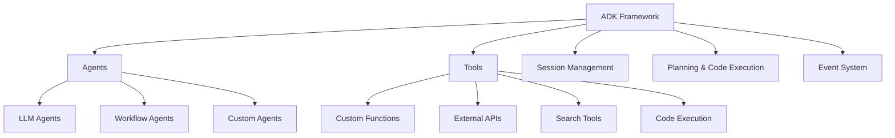

# ADK Framework & Providence Tennis AI Agent Analysis

**Date**: February 5, 2026  
**Purpose**: Understanding how Google's ADK relates to the Providence Tennis AI Agent

---

## Table of Contents
1. [ADK Overview](#adk-overview)
2. [Providence Tennis AI Agent Architecture](#providence-tennis-ai-agent-architecture)
3. [Comparison: ADK vs Current Implementation](#comparison)
4. [Opportunities for ADK Integration](#opportunities)
5. [Current System Strengths](#current-system-strengths)
6. [Recommendations](#recommendations)

---

## ADK Overview

### What is ADK?

**ADK (Agent Development Kit)** is Google's flexible, open-source framework for building, evaluating, and deploying AI agents. It's model-agnostic and designed to make agent development feel like traditional software development.

### Core Components



### Key Primitives

1. **Agents**: Self-contained execution units
   - **LLM Agents**: Use language models for flexible reasoning
   - **Workflow Agents**: Deterministic execution (Sequential, Parallel, Loop)
   - **Custom Agents**: Extend BaseAgent for specialized needs

2. **Tools**: Extend agent capabilities
   - Custom functions
   - API integrations
   - Search capabilities
   - Code execution

3. **Session Management**: Conversation context and memory

4. **Planning**: Break down complex tasks

5. **Event System**: Represent interactions and conversation history

### ADK Capabilities

- ✅ Multi-agent system design
- ✅ Hierarchical composition
- ✅ Rich tool ecosystem
- ✅ Flexible orchestration
- ✅ Built-in evaluation tools
- ✅ Multiple deployment options (local, Vertex AI, Cloud Run, Docker)

### Supported Languages
- Python, TypeScript, Go, Java

---

## Providence Tennis AI Agent Architecture

### Current Architecture (3-Tier)

```
┌─────────────────────────────────────────────────┐
│              FRONTEND LAYER                     │
│  AIAssistant.tsx (React Component)              │
│  - Chat UI                                      │
│  - Message history                              │
│  - User input handling                          │
│  - Framer Motion animations                     │
└────────────────┬────────────────────────────────┘
                 │ HTTP POST /api/chat
                 ▼
┌─────────────────────────────────────────────────┐
│              API LAYER                          │
│  app/api/chat/route.ts (Next.js API Route)     │
│  - Request validation                           │
│  - Error handling                               │
│  - Response formatting                          │
│  - History sanitization                         │
└────────────────┬────────────────────────────────┘
                 │ Function call
                 ▼
┌─────────────────────────────────────────────────┐
│              AI LOGIC LAYER                     │
│  lib/ai-agent.ts                                │
│  - Gemini 3 Flash Preview                       │
│  - Google Search tool                           │
│  - Conversation management                      │
│  - Source extraction                            │
│  - System instruction (TENNIS_CONTEXT)          │
└─────────────────────────────────────────────────┘
```

### Technology Stack

| Component | Technology | Purpose |
|-----------|-----------|---------|
| **Model** | Gemini 3 Flash Preview | LLM intelligence |
| **SDK** | @google/generative-ai v0.21.0 | Gemini API integration |
| **Frontend** | React + TypeScript | UI |
| **Backend** | Next.js 14 API Routes | HTTP layer |
| **Animations** | Framer Motion | UI/UX |
| **Search** | Google Search (built-in tool) | Web search capability |

### Key Features

1. **Conversational AI**: Multi-turn conversations
2. **Web Search Integration**: Automatic web search when needed
3. **Source Citations**: Links to sources
4. **Context Awareness**: Tennis academy facility info
5. **Real-time**: Fast responses with Gemini 3 Flash

### Data Flow

```
User Input → Frontend → API Route → AI Agent → Gemini 3 → Response
                                    ↓
                              Google Search
                              (if needed)
```

### System Instruction (TENNIS_CONTEXT)

The agent has embedded context about:
- Facility information (address, phone, hours)
- Court details (10 outdoor Har-Tru clay courts)
- Programs (junior, adult, lessons, clinics, camps)
- Services (reservations, pro shop, repairs)

---

## Comparison: ADK vs Current Implementation

### Similarities

| Feature | ADK | Providence Tennis Agent | Status |
|---------|-----|------------------------|--------|
| **LLM Integration** | ✅ Model-agnostic | ✅ Gemini 3 Flash | Similar |
| **Tool Support** | ✅ Custom tools | ✅ Google Search | Similar |
| **Context Management** | ✅ Session & memory | ✅ Conversation history | Similar |
| **Event System** | ✅ Interaction events | ✅ Message history | Similar |

### Differences

| Aspect | ADK | Providence Tennis Agent | Gap |
|--------|-----|------------------------|-----|
| **Agent Types** | LLM, Workflow, Custom | LLM only | ⚠️ Limited |
| **Multi-agent** | ✅ Hierarchical composition | ❌ Single agent | ⚠️ Not supported |
| **Planning** | ✅ Built-in task breakdown | ❌ Not implemented | ⚠️ Missing |
| **Code Execution** | ✅ Sandboxed execution | ❌ Not available | ⚠️ Missing |
| **Evaluation** | ✅ Built-in tools | ❌ Manual testing | ⚠️ Missing |
| **Deployment** | ✅ Multiple options | ✅ Next.js (self-hosted) | ✅ Good |
| **Tool Ecosystem** | ✅ Rich, extensible | ⚠️ Single tool (search) | ⚠️ Limited |

### Architecture Comparison

**ADK Approach:**
```python
# ADK-style agent (Python)
from adk import LlmAgent, Session

agent = LlmAgent(
    model="gemini-3-flash-preview",
    tools=[google_search, custom_booking_tool],
    system_instruction=TENNIS_CONTEXT
)

session = Session()
response = agent.generate(message, session=session)
```

**Current Approach:**
```typescript
// Current implementation (TypeScript)
const model = genAI.getGenerativeModel({
  model: "gemini-3-flash-preview",
  tools: [{ googleSearch: {} }],
  systemInstruction: { parts: [{ text: TENNIS_CONTEXT }] }
});

const chat = model.startChat({ history });
const result = await chat.sendMessage(message);
```

### Evaluation

| Category | Current Score | ADK Score | Winner |
|----------|--------------|-----------|--------|
| **Simplicity** | 🟢 High | 🟡 Medium | Current |
| **Flexibility** | 🟡 Medium | 🟢 High | ADK |
| **Multi-agent** | 🔴 None | 🟢 Full | ADK |
| **Tool Ecosystem** | 🟡 Limited | 🟢 Rich | ADK |
| **Deployment** | 🟢 Easy | 🟢 Multiple | Tie |
| **Maintenance** | 🟢 Low | 🟡 Medium | Current |
| **TypeScript** | 🟢 Native | 🟢 Supported | Tie |

---

## Opportunities for ADK Integration

### 1. Multi-Agent System

**Current**: Single AI agent handles all queries

**With ADK**: Specialized agents for different tasks

```
┌─────────────────────────────────────────┐
│         Router Agent (Main)             │
│  Routes queries to specialized agents   │
└────────┬─────┬─────────┬────────────────┘
         │     │         │
    ┌────▼──┐ ┌▼───────┐ ┌▼──────────┐
    │General│ │Booking │ │Programs   │
    │Info   │ │Agent   │ │Agent      │
    │Agent  │ │        │ │           │
    └───────┘ └────────┘ └───────────┘
```

**Benefits**:
- Specialized expertise per domain
- Better context management
- Reduced token usage
- Easier to maintain/update

### 2. Booking Agent with Tools

**Current**: AI can only provide information, cannot book

**With ADK**: Custom tool for actual booking

```python
# ADK Booking Tool
@tool
def book_court(date: str, time: str, court_id: str, user_id: str) -> dict:
    """Book a tennis court for the user"""
    # Call backend API
    result = api.create_reservation(date, time, court_id, user_id)
    return result

booking_agent = LlmAgent(
    model="gemini-3-flash-preview",
    tools=[book_court, check_availability],
    system_instruction="You are a booking specialist..."
)
```

**Benefits**:
- End-to-end booking in chat
- No need to leave conversation
- Better user experience
- Increased automation

### 3. Workflow Agents for Multi-Step Tasks

**Example**: Lesson signup flow

```python
# Sequential workflow
lesson_workflow = SequentialWorkflow([
    check_availability_agent,
    match_instructor_agent,
    process_payment_agent,
    send_confirmation_agent
])
```

**Benefits**:
- Deterministic multi-step processes
- Error handling at each step
- Easy to test and maintain

### 4. Code Execution for Complex Calculations

**Example**: Schedule optimization

```python
# Code execution agent
schedule_agent = LlmAgent(
    model="gemini-3-flash-preview",
    tools=[code_execution],
    system_instruction="Optimize court schedules..."
)

# Agent can generate and run Python code
result = schedule_agent.generate(
    "Find the optimal court schedule for 20 players"
)
```

### 5. Evaluation Framework

**Current**: Manual testing only

**With ADK**: Automated evaluation

```python
# ADK evaluation
from adk import evaluate

test_cases = [
    {"input": "What are your hours?", "expected": "8:00 AM - 9:00 PM"},
    {"input": "How many courts?", "expected": "10 outdoor Har-Tru clay courts"}
]

results = evaluate(agent, test_cases)
print(f"Accuracy: {results.accuracy}")
```

---

## Current System Strengths

### Why the Current Implementation Works Well

1. **Simplicity** ✅
   - Single file for AI logic (`lib/ai-agent.ts`)
   - Straightforward Next.js API route
   - Easy to understand and maintain

2. **Integration** ✅
   - Seamlessly integrated with Next.js
   - No additional infrastructure needed
   - Works with existing auth system

3. **Performance** ✅
   - Fast responses with Gemini 3 Flash
   - Minimal latency (< 2 seconds)
   - Efficient token usage

4. **Cost** ✅
   - Low operational cost
   - Pay-per-use model
   - No infrastructure overhead

5. **Maintenance** ✅
   - Few dependencies
   - Easy to debug
   - Clear code structure

6. **User Experience** ✅
   - Smooth chat interface
   - Source citations
   - Context awareness

### When Current System is Sufficient

- ✅ Simple Q&A interactions
- ✅ Information retrieval
- ✅ Small to medium traffic
- ✅ Limited scope (tennis academy)
- ✅ Single-purpose agent

---

## Recommendations

### Short-term (Keep Current System)

**Recommendation**: Continue with current implementation

**Rationale**:
- Current system meets all requirements
- Simple and maintainable
- Low operational cost
- Fast development velocity

**Improvements to Consider**:
1. **Add Booking Tool** (without ADK)
   ```typescript
   // Custom tool for booking
   tools: [
     { googleSearch: {} },
     {
       functionDeclarations: [{
         name: "bookCourt",
         description: "Book a tennis court",
         parameters: { /* ... */ }
       }]
     }
   ]
   ```

2. **Response Streaming**
   ```typescript
   // Stream responses for better UX
   const result = await chat.sendMessageStream(message);
   for await (const chunk of result.stream) {
     // Send chunk to frontend
   }
   ```

3. **Enhanced Context**
   - Add more facility details
   - Include pricing information
   - Program schedules

4. **Analytics**
   - Track common questions
   - Monitor response quality
   - Identify improvement areas

### Medium-term (Consider ADK)

**When to Adopt ADK**:
- Need multi-agent orchestration
- Complex workflows required
- Code execution needed
- Advanced tool integration
- Evaluation framework desired

**Migration Path**:
1. **Phase 1**: Add ADK alongside current system
2. **Phase 2**: Migrate one feature to ADK (e.g., booking agent)
3. **Phase 3**: Evaluate performance and DX
4. **Phase 4**: Decide on full migration or hybrid approach

### Long-term (ADK Integration Strategy)

**Hybrid Architecture**:

```
┌────────────────────────────────────────────┐
│         Frontend (React)                   │
└────────┬───────────────────────────────────┘
         │
    ┌────▼───────┐
    │   Router   │
    └──┬───────┬─┘
       │       │
  ┌────▼──┐  ┌▼────────────┐
  │Simple │  │ADK Multi-    │
  │Agent  │  │Agent System  │
  │(Info) │  │(Booking,     │
  │       │  │Programs)     │
  └───────┘  └──────────────┘
```

**Benefits**:
- Keep simplicity for basic tasks
- Use ADK for complex workflows
- Gradual migration path
- Best of both worlds

---

## Conclusion

### Current State ✅

**Providence Tennis AI Agent** is well-designed and appropriate for its use case:
- Simple, effective architecture
- Good user experience
- Easy to maintain
- Cost-efficient

### ADK Advantages 🚀

**Google's ADK** offers advanced capabilities:
- Multi-agent systems
- Rich tool ecosystem
- Planning and code execution
- Evaluation framework
- Production-grade features

### Recommendation 💡

**For Providence Tennis Academy**:

1. **NOW**: Keep current system, it works well
2. **ENHANCE**: Add custom tools (booking, availability)
3. **EXPLORE**: Prototype ADK for specific use cases
4. **DECIDE**: Evaluate ROI of ADK migration

The current system is **production-ready** and **sufficient** for current needs. ADK would be beneficial for more complex agent workflows or multi-agent orchestration, but isn't necessary at this stage.

### Decision Matrix

| Need | Current System | ADK Required |
|------|---------------|--------------|
| Information Q&A | ✅ Perfect | ❌ Overkill |
| Web search | ✅ Works great | ❌ Not needed |
| Simple chat | ✅ Excellent | ❌ Unnecessary |
| Multi-agent | ❌ Not supported | ✅ Use ADK |
| Complex workflows | ⚠️ Possible but hard | ✅ Use ADK |
| Code execution | ❌ Not available | ✅ Use ADK |
| Advanced tools | ⚠️ Limited | ✅ Use ADK |

---

## References

### Documentation
- [Google ADK Docs](https://google.github.io/adk-docs/)
- [Providence Tennis AI Agent Docs](../agents/public-assistant.md)
- [Gemini API Docs](https://ai.google.dev/gemini-api/docs)

### Related Files
- `lib/ai-agent.ts` - Current AI implementation
- `app/api/chat/route.ts` - API endpoint
- `components/AIAssistant.tsx` - Frontend component

---

**Analysis by**: AI Agent  
**Date**: February 5, 2026  
**Version**: 1.0  
**Status**: ✅ Current system is production-ready and appropriate
